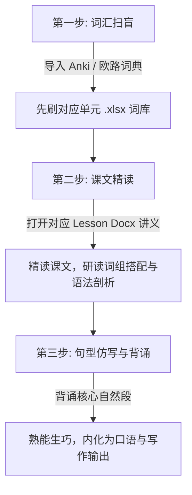

# 📘 新概念英语全套词库与课文精讲讲义 (New Concept English)

> 🌟 **本目录已完成全面整合，集成了《新概念英语》全阶段词汇表（16 本 Excel 词书）以及第三册、第四册共 108 篇课文的完整讲义与笔记（Docx 格式），并附赠第三册完整笔记合并版 PDF。**

---

## 🗂️ 目录结构总览

```text
📁 8.新概念英语
│
├── 📂 词汇表（.xlsx 兼容各类背单词软件）
│   ├── 📗 经典版（新版 1-4 册）：
│   │   ├── 新概念英语第一册（新版）.xlsx
│   │   ├── 新概念英语第二册（新版）.xlsx
│   │   ├── 新概念英语第三册（新版）.xlsx
│   │   └── 新概念英语第四册（新版）.xlsx
│   └── 📘 青少版（入门级至 5B 全套）：
│       ├── 新概念英语青少版入门级A.xlsx / 入门级B.xlsx
│       ├── 新概念英语青少版1A.xlsx / 1B.xlsx
│       ├── 新概念英语青少版2A.xlsx / 2B.xlsx
│       ├── 新概念英语青少版3A.xlsx / 3B.xlsx
│       ├── 新概念英语青少版4A.xlsx / 4B.xlsx
│       └── 新概念英语青少版5A.xlsx / 5B.xlsx
│
└── 📂 新概念课文精讲与笔记（Docx）/
    ├── 📂 第三册（Lesson 01-60）/
    │   ├── 📄 新概念3册完整笔记 Lesson 01.docx ~ Lesson 60.docx (共 60 课)
    │   └── 📕 新概念3册完整笔记合并 1.0.pdf (47.4 MB，全册合订版)
    │
    └── 📂 第四册（Lesson 01-48）/
        ├── 📄 新概念4册完整笔记 Lesson 01.docx ~ Lesson 32.docx (共 32 课)
        └── 📄 新概念4册完整讲义 Lesson 33.docx ~ Lesson 48.docx (共 16 课)
```

---

## 📚 1. 词汇库分类详解 (.xlsx)

所有词汇表均已整理为标准 Excel 格式，包含中英文释义与音标，可无缝导入 **Anki**、**欧路词典**、**Quizlet**、**不背单词** 等背诵工具：

| 分类 | 资源文件 | 适用对象与阶段 |
| :--- | :--- | :--- |
| **经典新版·第一册** | `新概念英语第一册（新版）.xlsx` | 英语零基础 / 初学者，夯实语音与基础生活会话 |
| **经典新版·第二册** | `新概念英语第二册（新版）.xlsx` | 初中至高一水平，构建扎实语法体系与常见表达 |
| **经典新版·第三册** | `新概念英语第三册（新版）.xlsx` | 高中至四级水平，突破中高级词汇、长难句与篇章技能 |
| **经典新版·第四册** | `新概念英语第四册（新版）.xlsx` | 六级、考研、雅思托福及高级英语学习者，领略地道人文英美散文 |
| **青少版·入门级** | `新概念英语青少版入门级A.xlsx`<br>`新概念英语青少版入门级B.xlsx` | 幼儿启蒙 / 小学低年级阶段英语兴趣培养 |
| **青少版·1A-2B** | `新概念英语青少版1A/1B/2A/2B.xlsx` | 小学阶段同步进阶，贴合青少年认知情境 |
| **青少版·3A-5B** | `新概念英语青少版3A/3B/4A/4B/5A/5B.xlsx` | 小升初至初中阶段，系统掌握中考核心考点语法与高频词汇 |

---

## 📝 2. 课文精讲与完整笔记 (.docx)

位于 `新概念课文精讲与笔记（Docx）/` 目录下，是针对经典课文的深度学习讲义，适合精读、自学备课与深度研读。

### 📌 第三册（Developing Skills 培养技能）
- **涵盖范围**：Lesson 01 至 Lesson 60（全 60 课独立 Docx 文档）
- **核心特色**：
  - 每课包含生词详注、国际音标 (IPA)、常见发音联想、重点词组与英美用法差异；
  - 核心长难句深度语法剖析与仿写造句；
  - 附带 `新概念3册完整笔记合并 1.0.pdf`，便于在 iPad / 电子书阅读器上随身翻阅。

### 📌 第四册（Fluency in English 流利英语）
- **涵盖范围**：Lesson 01 至 Lesson 48（全 48 课独立 Docx 文档）
- **核心特色**：
  - Lesson 01 ~ 32：完整课文精读笔记，涵盖哲学、艺术、考古、生物、天文等多元题材；
  - Lesson 33 ~ 48：高级讲义篇，深度解析地道英伦文风、修辞鉴赏与高级学术写作技巧；
  - 适合雅思 7.5+、托福 105+、考研英语一高分冲刺及英语专业精读训练。

---

## 💡 3. 推荐学习方法与工具搭配



1. **搭配 Anki 记忆卡片**：
   - 打开 Anki，选择 `文件` -> `导入`，选中对应册数的 `.xlsx`（或另存为 `.csv`），指定单词列、音标列、中文解释列即可自动生成记忆卡片。
2. **配合 Docx 讲义进行课文精读**：
   - 学习每一课前先看 Docx 中的生词音标与词义拓展，扫清生词障碍；
   - 研读课文时参考讲义中的句法拆解与名师精讲批注，理解作者的谋篇布局与修辞意图；
   - 摘抄讲义中整理的地道搭配（Collocations），用于日常口语交流或书面写作。
