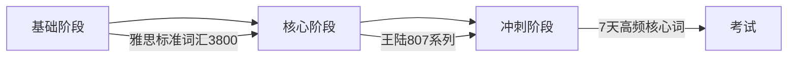

# 🌐 全网最全英语单词词库 (Anki/Quizlet 等背词工具兼容)

[](https://github.com/lilinji/english-word-library)
[](#-雅思资源专项-ielts-focus)
[](#-托福资源-toefl)
[](https://creativecommons.org/licenses/by-nc-sa/4.0/)


> 🚀 **本项目致力于提供最全面、最系统、最优质的英语单词词库，涵盖从小学到博士、从雅思托福到商务英语的所有核心内容。所有词库均包含中文释义与标准国际音标 (IPA)，可轻松导入各类主流背单词应用。**

---

## 📖 项目简介

本仓库是一个精心整理的英语词库资源集合，旨在为不同学习阶段和备考目标的英语学习者提供一站式词汇解决方案。无论你是正在备战中考、高考的学生，还是准备雅思、托福、GRE 的留学党，亦或是希望提升职场英语的白领，都能在这里找到适合自己的词汇资源。

### 🎯 适用人群

| 人群        | 推荐资源                  |
| ----------- | ------------------------- |
| 🎒 中小学生 | 全国各大教材版本同步词库  |
| 🎓 大学生   | 四六级、专四专八核心词汇  |
| 📚 考研党   | 考研深度专题（190+ 词书） |
| ✈️ 留学党   | 雅思、托福、GRE 高频词汇  |
| 💼 职场人士 | 商务英语、国际英语        |

---

## 🌟 仓库特色

| 特色              | 描述                                                                                |
| ----------------- | ----------------------------------------------------------------------------------- |
| **📦 海量覆盖**   | 包含上千本词书，覆盖全国各大主流教材版本。                                          |
| **🗂️ 结构化管理** | 按教育阶段与应用场景精细分类，目录清晰，方便快速定位所需资源。                      |
| **✨ 高质量内容** | 所有词库均配有精准中文释义与国际音标 (IPA)，助力听说读写全方位提升。                |
| **🔗 高度兼容**   | 采用通用 `.xlsx` 格式存储，可轻松导入 Anki、Quizlet、欧路词典、有道词典等主流工具。 |
| **🆓 完全免费**   | 所有资源均为社区贡献，免费开放，无任何付费门槛。                                    |

---

## 📂 词库目录结构

```text
📁 含音标（新版）
├── 📂 1.全国各大教材版本中小学同步/    (328 本词书)
│   ├── 人教版 / 外研版 / 北师大版 / 苏教版 / 冀教版 ...
│   └── 涵盖小学至高中各年级同步词汇
│
├── 📂 2.中考/                          (9 本词书)
├── 📂 2.高考/                          (47 本词书)
│
├── 📂 3.大学英语/                      (69 本词书)
├── 📂 3.专四/                          (15 本词书)
├── 📂 3.四级/                          (30 本词书)
│
├── 📂 4.六级/                          (46 本词书)
├── 📂 4.专八/                          (14 本词书)
│
├── 📂 5.考研/                          (190 本词书) 🔥 热门
│   ├── 恋练有词 / 考研红宝书 / 新东方 ...
│   └── 覆盖考研英语一、英语二核心词汇
│
├── 📂 6.研究生/                        (9 本词书)
├── 📂 6.考博/                          (6 本词书)
│
├── 📂 7.托福/                          (21 本词书) 🏆 重点
├── 📂 7.雅思/                          (30 本词书) 🏆 重点
│
├── 📂 8.商务英语/                      (4 本词书)
├── 📂 8.国际英语/                      (12 本词书)
├── 📂 8.新世纪英专/                    (12 本词书)
├── 📂 8.新概念英语/                    (16 本词书 + 108 篇三四册课文精讲讲义)
│   ├── 词汇表（1-4册新版 + 青少版全套）
│   └── 新概念课文精讲与笔记（第三册60课 + 第四册48课 Docx/PDF）
└── 📂 9.其他（更多）/                  (93 本词书)
    ├── SAT / GRE / GMAT ...
    └── 各类专业词汇、词根词缀等
├── 📂 9.扇贝英语（IT）                 (18 本词书)
```

---

## 🎓 雅思资源专项 (IELTS Focus)

针对雅思考生，我们特别整理了业内公认的备考神书，全方位覆盖**听、说、读、写**四个维度。

### 📚 核心词汇书推荐

| 分类                 | 资源                                      | 特点                             |
| -------------------- | ----------------------------------------- | -------------------------------- |
| **📘 场景分类**      | `IELTS词汇词以类记.xlsx`                  | 按话题分类，场景化记忆，最高效！ |
| **📙 王陆 807 系列** | `王陆807雅思词汇听力/口语/阅读/写作.xlsx` | 雅思考生必备，高频机经核心词     |
| **📗 真题词汇**      | `雅思真词汇（第3-6版）.xlsx`              | 深度剖析剑桥雅思 4-17 真题库     |
| **📒 高频速成**      | `7天搞定雅思高频核心词.xlsx`              | 适合考前冲刺与快速扫盲           |
| **📕 词汇胜经**      | `雅思词汇胜经.xlsx`                       | 系统全面，适合长期备考           |
| **📓 剑桥精典**      | `剑桥雅思词汇精典.xlsx`                   | 权威剑桥官方词汇整理             |

### 🔤 词汇特色分类

- **乱序版**：打破字母顺序，更符合人类大脑记忆规律，避免产生位置依赖。
- **必备词组**：不仅仅是单个单词，更注重地道短语表达与搭配。
- **分级词汇**：如《雅思分级词汇 21 天进阶》，循序渐进，由易到难。

### 📊 雅思词汇学习建议



---

## ✈️ 托福资源 (TOEFL)

| 资源                        | 描述                     |
| --------------------------- | ------------------------ |
| `TOEFL词汇词以类记.xlsx`    | 按场景分类的托福核心词汇 |
| `托福词汇乱序版.xlsx`       | 打破字母顺序的记忆法     |
| `托福核心词汇21天突破.xlsx` | 短期冲刺利器             |

---

## 📘 新概念英语专项 (New Concept English)

针对系统提升英语综合能力的学习者，我们整合了从入门到精通的完整学习链条，包含词汇与名师讲义双核心：

| 模块 | 资源内容 | 说明 |
| :--- | :--- | :--- |
| **📗 词汇库 (Excel)** | `新概念英语第一至四册（新版）.xlsx`<br>`新概念英语青少版入门级至5B (12本).xlsx` | 全册配套词库，含音标与中文释义，可一键导入 Anki/欧路 |
| **📝 第三册课文精讲 (Docx)** | `新概念3册完整笔记 Lesson 01-60 (60篇)` | 涵盖词汇辨析、发音规律、句型结构及仿写练习（另附全册 PDF 合订版） |
| **📝 第四册课文讲义 (Docx)** | `新概念4册完整笔记/讲义 Lesson 01-48 (48篇)` | 涵盖散文精读、长难句拆解与高级写作赏析 |

> 📌 详细课文目录索引与配套精读指南请参阅 [8.新概念英语/README.md](file:///d:/English/8.新概念英语/README.md)。

---

## 🛠️ 如何使用

本词库采用通用的 `.xlsx` (Excel) 格式存储，可以方便地导入各类背单词工具。

### 📱 导入 Anki (推荐)

1. **下载 Anki**：前往 [Anki 官网](https://apps.ankiweb.net/) 下载桌面版。
2. **转换格式**：将 `.xlsx` 文件另存为 `.csv` 格式（UTF-8 编码）。
3. **导入文件**：打开 Anki，选择 `文件` → `导入`，选择 CSV 文件。
4. **映射字段**：确保"单词"、"音标"、"释义"字段对应正确。
5. **开始学习**：使用 Anki 的间隔重复算法高效记忆！

### 📝 导入 Quizlet

1. **访问 Quizlet**：前往 [Quizlet 官网](https://quizlet.com/)。
2. **创建学习集**：点击"创建"，选择"从 Excel 导入"。
3. **粘贴数据**：复制 Excel 中的数据并粘贴。
4. **保存学习集**：确认导入后保存即可。

### 📖 导入其他工具

本词库兼容以下工具（通过 CSV/Excel 导入）：

- 欧路词典
- 有道词典
- 扇贝单词
- 百词斩
- 不背单词

---

## 📋 词库格式说明

每个词库文件 (`.xlsx`) 通常包含以下字段：

| 列名              | 说明           | 示例                       |
| ----------------- | -------------- | -------------------------- |
| **单词**          | 英文单词原形   | `abandon`                  |
| **音标**          | 国际音标 (IPA) | `/əˈbændən/`               |
| **释义**          | 中文释义       | `v. 放弃；抛弃`            |
| **例句** _(可选)_ | 例句或用法说明 | `He abandoned his family.` |

---

## 🤝 贡献与反馈

我们欢迎社区的贡献和反馈！如果你有更好的词库资源，或者发现了任何错误，请通过以下方式参与：

### 📥 如何贡献

1. **Fork 本仓库**
2. **添加或修正词库文件**
3. **提交 Pull Request**

### 🔍 我们正在寻找

- [ ] 《剑桥雅思 18/19》最新真题词汇整理
- [ ] GRE 3000 词汇完整版
- [ ] 各专业领域词汇（医学、法律、金融等）
- [ ] 词根词缀系统整理

### 🐛 反馈问题

如果你发现释义或音标中存在错误，请提交 [Issue](../../issues)，我们会尽快修复。

---

## ⭐ Star History

如果这个项目对你有帮助，请给我们一个 ⭐ Star！

---

## 📄 版权声明

> ⚠️ **免责声明**
>
> 本仓库资源均整理自网络公开资源，仅供个人学习交流使用，严禁用于任何商业用途。
>
> 如有侵权，请联系删除。所有词书版权归原作者/出版社所有。

---

## 📬 联系方式

- **GitHub Issues**: [提交反馈](../../issues)
- **Pull Requests**: [贡献代码](../../pulls)

---

<div align="center">

💡 **Keep Learning, Keep Growing.**

_所有的努力都将在考场上开花结果！加油，屠鸭成功！_ 🦆

**Made with ❤️ by the Community Ringi**

</div>
